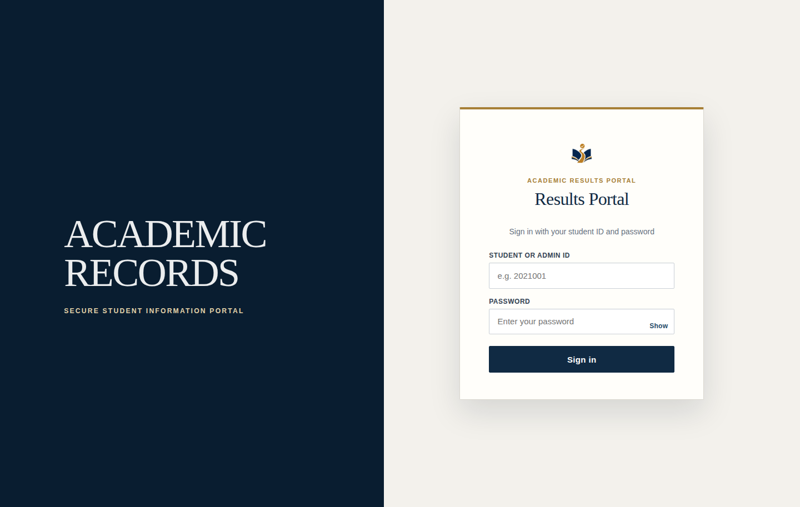
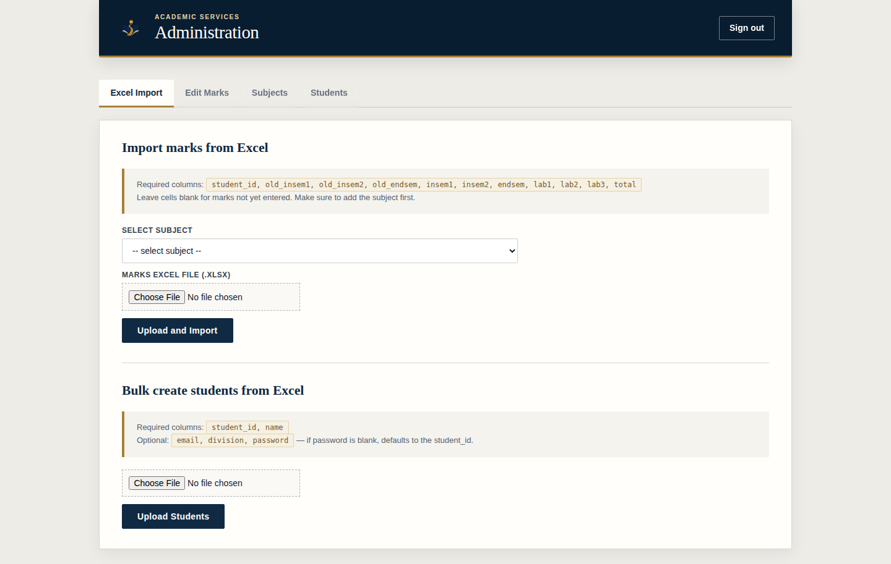
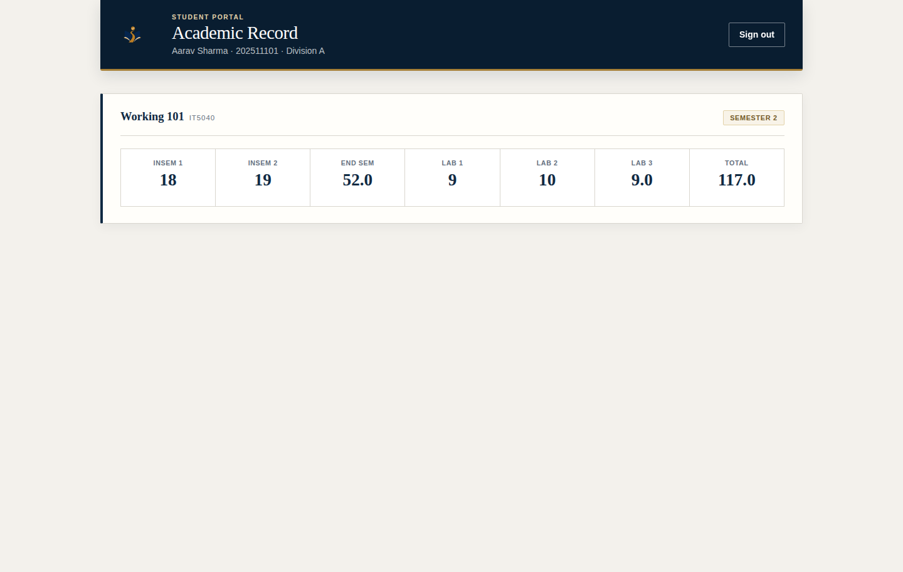
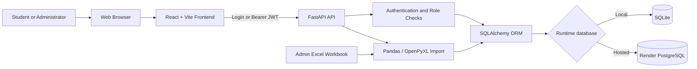

# Academic Results Portal

I built this portal as a marks viewer for a subject I supported as a Teaching Assistant (TA). It gives students a focused place to view published assessment results and provides an administrative workflow for managing students, subjects, marks, and Excel imports.

## Why I built this

I made this portal to publish and present the marks for a subject in which I worked as a Teaching Assistant. The initial goal was a simple, clear marks viewer for students; it then grew into a small full-stack system with protected student views, administrator tools, subject management, and repeatable Excel imports. The branding and sample data are intentionally generic so the project can be demonstrated or adapted without representing a real institution.

> **Local development:** React + FastAPI + SQLite on your computer.  
> **Hosted deployment:** React Static Site + FastAPI Web Service + PostgreSQL on Render.

## Application preview

### Sign in



### Administration



### Student academic record



## Technology stack

| Layer | Technologies | Responsibility |
|---|---|---|
| Frontend | React 18, Vite 5, React Router, Axios | Pages, navigation, protected routes, API requests |
| Backend | Python, FastAPI, Uvicorn, Pydantic | Authentication, API validation, business logic |
| Data access | SQLAlchemy ORM | Models, queries, sessions, relationships |
| Local database | SQLite | Portable development data in `backend/marks_portal.db` |
| Hosted database | Render PostgreSQL | Persistent deployed data |
| Authentication | OAuth2 form, JWT, SHA-256 + bcrypt | Password verification and eight-hour access tokens |
| Spreadsheet processing | Pandas, OpenPyXL | Student and marks Excel imports |
| Hosting | Render Static Site, Web Service, PostgreSQL | Public frontend, API, and database |

## Software architecture



### How a request works

1. The browser sends a student ID and password to `POST /auth/login`.
2. FastAPI verifies the bcrypt password hash and returns a signed JWT.
3. React stores the JWT in `sessionStorage`; Axios attaches it to later requests.
4. FastAPI validates the JWT and applies student/admin authorization checks.
5. SQLAlchemy accesses SQLite locally or PostgreSQL when hosted.
6. Student mark queries are filtered to the authenticated student.

## Local versus Render

| Concern | Local development | Render deployment |
|---|---|---|
| Frontend | `http://127.0.0.1:5173` | Render Static Site URL |
| Backend | `http://127.0.0.1:8000` | Render Web Service URL |
| Database | `backend/marks_portal.db` | Render PostgreSQL |
| Mode | `USE_LOCAL_DB=1` | Variable absent or `0` |
| API variable | `VITE_API_URL=http://127.0.0.1:8000` | Deployed backend HTTPS URL |
| Secrets | Local `.env` | Render Environment settings |

---

# Run locally

## Prerequisites

- Python 3.10 or newer
- Node.js 18 or newer
- npm

PostgreSQL is not required for local development.

## 1. Open the project

```bash
cd /home/student/Deep-Mtech/misc/marks-portal
```

If the project is cloned elsewhere, use that path instead.

## 2. Configure and start the backend

```bash
cd backend
python3 -m venv .venv
source .venv/bin/activate
python3 -m pip install --upgrade pip
python3 -m pip install -r requirements.txt
cp .env.example .env
```

Generate a signing key with `python3 -c "import secrets; print(secrets.token_hex(32))"`, then paste it into `backend/.env`:

```env
USE_LOCAL_DB=1
SECRET_KEY=<generated-random-value>
FRONTEND_URL=http://127.0.0.1:5173
```

`DATABASE_URL` is unnecessary locally. The backend automatically uses `backend/marks_portal.db`.

### Initialize or reset local data

> **Warning:** This deletes every student, subject, and mark in the local database.

```bash
python3 delete_all.py
```

The reset creates the development administrator `admin@results.local` with password `12345`. Never reuse this password in production.

Start FastAPI:

```bash
uvicorn main:app --reload --host 127.0.0.1 --port 8000
```

Keep this terminal open. API documentation is at `http://127.0.0.1:8000/docs`. A `404` at port 8000 `/` is expected because it serves the API, not the website.

## 3. Configure and start the frontend

Open a second terminal:

```bash
cd /home/student/Deep-Mtech/misc/marks-portal/frontend
npm install
cp .env.example .env
npm run dev
```

The frontend uses `VITE_API_URL=http://127.0.0.1:8000`. Open `http://127.0.0.1:5173/login`.

## 4. Load dummy data

The repository includes `backend/dummy_students.xlsx` and `backend/dummy_marks.xlsx`.

1. Sign in as the development administrator.
2. Upload `dummy_students.xlsx` under **Excel Import → Bulk create students**.
3. Under **Subjects**, create `IT5040`, `Working 101`, semester `2`.
4. Select that subject and upload `dummy_marks.xlsx`.
5. Test student `202511101` with password `202511101`.

Blank student passwords default to the corresponding student ID. Press `Ctrl+C` in both terminals to stop the application.

---

# Deploy globally on Render

Use three Render resources:

1. **Render PostgreSQL** for persistent data
2. **Render Web Service** for FastAPI
3. **Render Static Site** for React

Do not deploy SQLite on a normal Render web service. Its local filesystem is ephemeral, so the database file can disappear after a restart or redeploy.

## 1. Push the project to GitHub or GitLab

Render deploys from a linked repository. Never commit `backend/.env`, `backend/*.db`, `frontend/.env`, `node_modules`, or `dist`. The provided `.gitignore` excludes them.

## 2. Create Render PostgreSQL

1. Select **New → PostgreSQL**.
2. Choose the same region as the future backend.
3. Wait for status **Available**.
4. Keep the **Internal Database URL** for the Render backend and the **External Database URL** for maintenance from your computer.

Free Render PostgreSQL instances expire after 30 days. Use a paid instance for durable production data or replace expired development databases.

## 3. Deploy FastAPI as a Web Service

Create **New → Web Service** and use:

| Setting | Value |
|---|---|
| Runtime | Python 3 |
| Root Directory | `misc/marks-portal/backend` |
| Build Command | `pip install -r requirements.txt` |
| Start Command | `uvicorn main:app --host 0.0.0.0 --port $PORT` |

If `marks-portal` itself is the repository root, use `backend` as the Root Directory.

Set these backend environment variables:

| Variable | Value |
|---|---|
| `DATABASE_URL` | PostgreSQL **Internal Database URL** |
| `SECRET_KEY` | A new random production secret |
| `FRONTEND_URL` | Public frontend HTTPS URL after step 4 |
| `ALLOWED_ORIGINS` | Public frontend HTTPS URL |

Do not set `USE_LOCAL_DB=1` on Render. Delete the variable or set it to `0`.

Generate a secret with `python3 -c "import secrets; print(secrets.token_hex(32))"`. The app creates tables at startup. Verify the API at `https://<backend>.onrender.com/docs`.

## 4. Deploy React as a Static Site

Create **New → Static Site** and use:

| Setting | Value |
|---|---|
| Root Directory | `misc/marks-portal/frontend` |
| Build Command | `npm install && npm run build` |
| Publish Directory | `dist` |

If `marks-portal` is the repository root, use `frontend` as the Root Directory.

Add this build-time environment variable:

```env
VITE_API_URL=https://<backend-service>.onrender.com
```

Add the React Router rewrite:

| Source | Destination | Action |
|---|---|---|
| `/*` | `/index.html` | Rewrite |

## 5. Finish CORS configuration

After the frontend receives its URL, set both backend variables to that exact origin and redeploy:

```env
FRONTEND_URL=https://<frontend-service>.onrender.com
ALLOWED_ORIGINS=https://<frontend-service>.onrender.com
```

Avoid a trailing slash.

## 6. Create the production administrator

> Never run `delete_all.py` against production unless you deliberately intend to erase the hosted database.

From a trusted computer, use the PostgreSQL **External Database URL**:

```bash
cd backend
source .venv/bin/activate
USE_LOCAL_DB=0 DATABASE_URL='<RENDER_EXTERNAL_DATABASE_URL>' python3 create_admin.py
```

Enter a unique administrator ID, name, and strong password. If external access is restricted, temporarily allow your public IP in the database Networking settings.

## 7. Production checklist

- Backend `/docs` loads over HTTPS
- Frontend and `/login` load after a browser refresh
- Admin login redirects to `/admin`
- Student login shows only that student's record
- Excel imports persist in PostgreSQL
- CORS allows only the intended frontend
- `USE_LOCAL_DB` is absent or `0`
- No `.env`, `.db`, or real student spreadsheet is committed

## API overview

| Method | Endpoint | Access | Purpose |
|---|---|---|---|
| `POST` | `/auth/login` | Public | Authenticate and issue a JWT |
| `GET` | `/me` | Authenticated | Current user profile |
| `GET` | `/marks` | Student | Current student's marks |
| `GET` | `/admin/students` | Admin | List students |
| `POST` | `/admin/students` | Admin | Create one student |
| `POST` | `/admin/bulk-create-students` | Admin | Import students from Excel |
| `GET` | `/admin/subjects` | Admin | List subjects |
| `POST` | `/admin/subjects` | Admin | Create a subject |
| `PUT` | `/admin/marks` | Admin | Create or update marks |
| `POST` | `/admin/import-excel` | Admin | Import marks for a subject |

## Project structure

```text
marks-portal/
├── README.md
├── backend/
│   ├── main.py                 # FastAPI routes and imports
│   ├── auth.py                 # JWT and password handling
│   ├── database.py             # SQLite/PostgreSQL selection
│   ├── models.py               # SQLAlchemy models
│   ├── create_admin.py         # Administrator creation
│   ├── delete_all.py           # Destructive local reset/demo seed
│   ├── requirements.txt
│   ├── .env.example
│   ├── dummy_students.xlsx
│   └── dummy_marks.xlsx
└── frontend/
    ├── src/pages/              # Login, dashboard, administration
    ├── src/api.js              # Axios API client
    ├── src/styles/theme.css    # Formal visual system
    ├── screenshots/
    ├── .env.example
    └── package.json
```

## Troubleshooting

### Login always reports invalid credentials

- Confirm FastAPI is running on port `8000`.
- Confirm `VITE_API_URL` points to the same backend.
- Restart Vite after changing `.env`.
- Confirm backend and frontend are using the intended database mode.

### `SSL connection has been closed unexpectedly`

- The hosted database may be expired or unavailable.
- Confirm Render PostgreSQL status is **Available**.
- Local development should set `USE_LOCAL_DB=1`.
- Local maintenance against Render must use the **External Database URL**.

### Port 8000 shows `{"detail":"Not Found"}`

This is expected at `/`. Use `/docs` for the API interface or port `5173` for the local frontend.

### A hosted route returns 404 after refresh

Add the Render Static Site rewrite `/*` → `/index.html` with action **Rewrite**.

## Deployment references

- [Render: Deploy a FastAPI app](https://render.com/docs/deploy-fastapi)
- [Render: Create and connect to PostgreSQL](https://render.com/docs/postgresql-creating-connecting)
- [Render: Static sites](https://render.com/docs/static-sites)
- [Render: Static-site redirects and rewrites](https://render.com/docs/redirects-rewrites)
- [Render: Free service limitations](https://render.com/docs/free)
